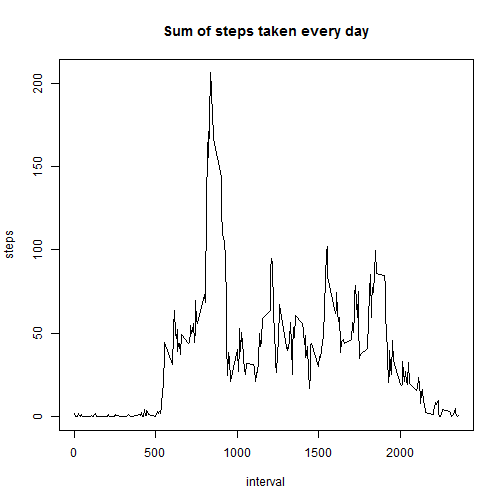
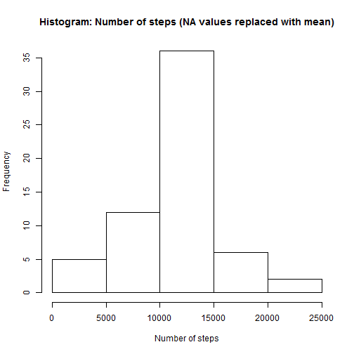
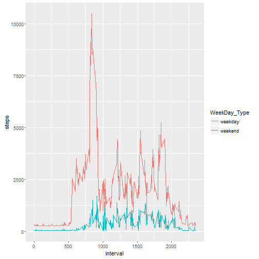

`{r} time`

##Loading and preprocessing the data


Read data:

```r
st <- read.csv("C:/Users/Marcin/Desktop/R/repdata-data-activity/activity.csv", header = TRUE)
```

Filter out NA values:

```r
st_cl <- st[!is.na(st$steps),]
```

Aggregate by date and name columns:

```r
st_cl_agr <- aggregate(st_cl$steps, by = list(st_cl$date), FUN = "sum" )
names(st_cl_agr) <- c("date","steps")
```

##What is mean total number of steps taken per day?


```r
hist(st_cl_agr$steps, xlab="Number of steps", main = "Histogram: Number of steps")
```


```r
aMean <- mean(st_cl_agr$steps)
```


```r
aMedian <- median(st_cl_agr$steps)
```

Mean is 1.0766189 &times; 10<sup>4</sup> , median is 10765

##What is the average daily activity pattern?

Aggregate by interval and name columns:

```r
st_cl_agr2 <- aggregate(st_cl$steps, by = list(st_cl$interval) , FUN = "mean" )
names(st_cl_agr2) <- c("interval","steps")
```


```r
with(st_cl_agr2, plot(interval, steps, type = "l", main = "Sum of steps taken every day"))
```




```r
paste("The highest value of interval: [", st_cl_agr2[which.max(st_cl_agr2$steps),2], "] for interval [", st_cl_agr2[which.max(st_cl_agr2$steps),1],"]")
```

```
## [1] "The highest value of interval: [ 206.169811320755 ] for interval [ 835 ]"
```

##Imputing missing values


```r
NAcount <- length(which(is.na(st$steps)))
```

Count of missing values is [2304]

I choose MEAN values of all steps (skipping NA values) to impute missing values,


```r
st_steps_NA <-  which(is.na(st$steps))
st_steps_Mean <- mean(st[which(!is.na(st$steps)),"steps"] )
st[st_steps_NA,"steps"]  <- st_steps_Mean
st_agr <- aggregate(st$steps, by = list(st$date), FUN = "sum" )
names(st_agr) <- c("date","steps")
hist(st_agr$steps, xlab="Number of steps", main = "Histogram: Number of steps (NA values replaced with mean)")
```



```r
a1Mean <- mean(st_agr$steps)
a1Median <- median(st_agr$steps)
```


New mean is 1.0766189 &times; 10<sup>4</sup>  and new median is 1.0766189 &times; 10<sup>4</sup>
what gives difference for median 0.0110421% and difference for mean 0%.


##Are there differences in activity patterns between weekdays and weekends?


```r
library(ggplot2)
st$wDay <- ifelse(weekdays(as.Date(st$date)) == c('Samstag','Sonntag'), 'weekend','weekday')
st_agr_wDay <- aggregate(st$steps, by = list(st$interval, st$wDay), FUN = "sum" )
names(st_agr_wDay) <- c("interval","WeekDay_Type","steps")
with(st_agr_wDay, qplot(interval, steps, col = WeekDay_Type, geom = "line"))
```




